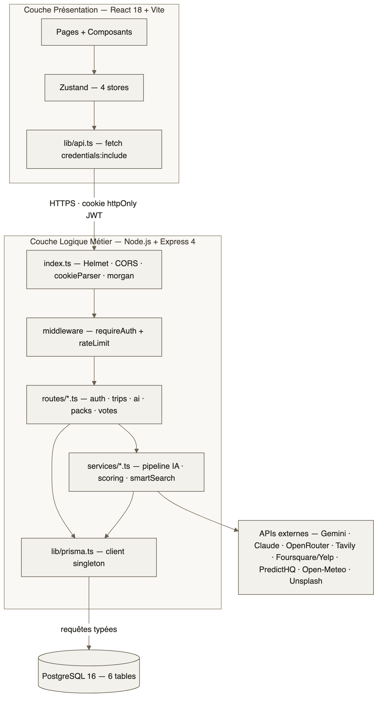
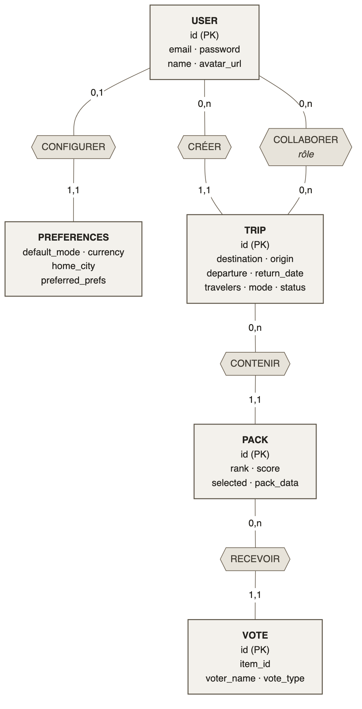
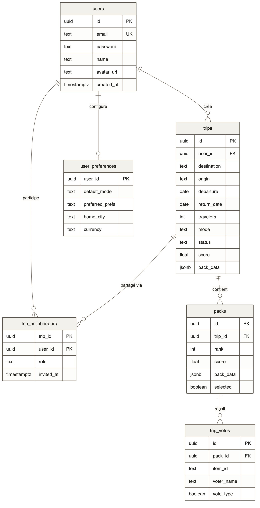
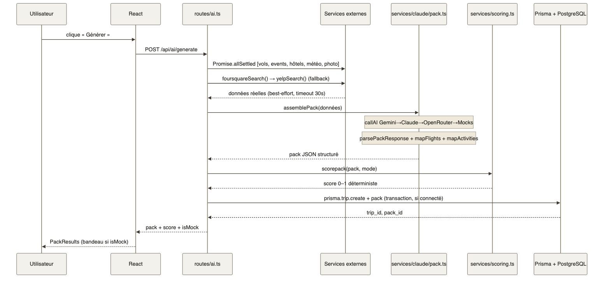
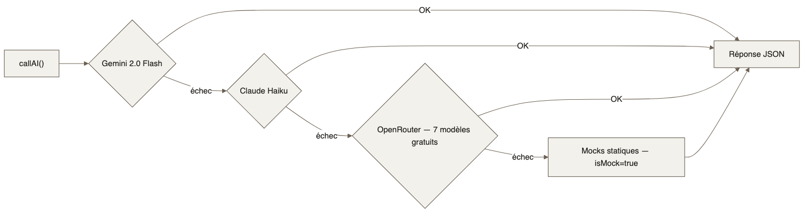
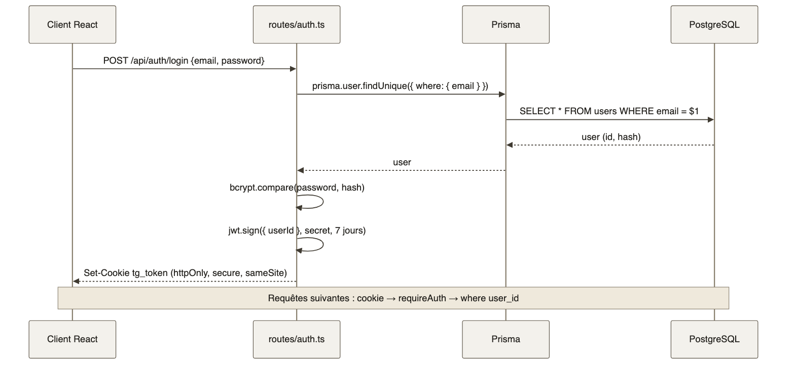
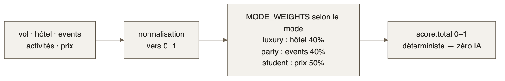
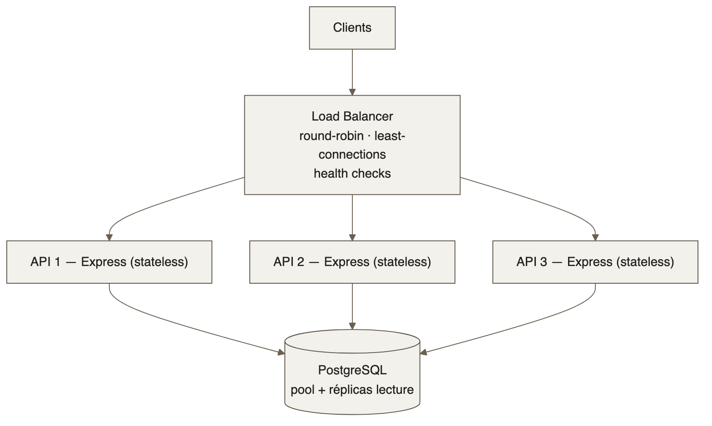

# Architecture & modélisation — TripGenie

Diagrammes de référence du projet. Chaque schéma est écrit en **Mermaid** (source `.mmd` versionnée) puis rendu en **PNG** avec un thème sobre commun ([`theme.json`](theme.json)) pour un rendu homogène dans le dossier et la documentation.

| # | Diagramme | Fichier |
|---|-----------|---------|
| 1 | Architecture en couches (3-tier) | [`architecture.png`](architecture.png) |
| 2 | MCD — Modèle Conceptuel de Données (Merise) | [`mcd.png`](mcd.png) |
| 3 | MLD — Modèle relationnel (ERD) | [`erd.png`](erd.png) |
| 4 | Pipeline de génération d'un pack | [`seq_generate.png`](seq_generate.png) |
| 5 | Cascade LLM (fallback automatique) | [`llm_fallback.png`](llm_fallback.png) |
| 6 | Authentification JWT | [`seq_auth.png`](seq_auth.png) |
| 7 | Scoring déterministe | [`scoring.png`](scoring.png) |
| 8 | Scalabilité horizontale | [`scalability.png`](scalability.png) |

---

## 1. Architecture en couches (3-tier)



Architecture **3-tiers** classique :

- **Présentation** — React 18 + Vite, état global Zustand, appels HTTP centralisés dans `lib/api.ts` (`credentials: include`).
- **Logique métier** — Express 4 : `index.ts` (Helmet, CORS, cookie-parser, morgan), middleware (`requireAuth`, rate-limit), routes, services (pipeline IA, scoring, smartSearch) et le client Prisma singleton (`db/prisma.ts`).
- **Persistance** — PostgreSQL 16 (6 tables), accédé exclusivement via des **requêtes typées Prisma**.

Le JWT transite dans un **cookie httpOnly** ; les APIs externes sont toujours consommées côté serveur, jamais depuis le navigateur.

## 2. MCD — Modèle Conceptuel de Données (Merise)



Vue **conceptuelle** (méthode Merise), indépendante de PostgreSQL : **5 entités** (`USER`, `TRIP`, `PACK`, `VOTE`, `PREFERENCES`) reliées par **5 associations** porteuses de cardinalités `(0,1)`, `(1,1)`, `(0,n)`.

Point clé du passage **MCD → MLD** : l'association **n-n** `COLLABORER`, porteuse de l'attribut `rôle`, se matérialise par une **table d'association** — `trip_collaborators`. C'est ce qui explique le passage de 5 entités conceptuelles à 6 tables physiques.

## 3. MLD — Modèle relationnel (ERD)



Traduction **relationnelle** du MCD : les **6 tables** physiques avec leurs clés primaires (`PK`), étrangères (`FK`) et contraintes d'unicité (`UK`), en notation *crow's foot*. Les colonnes `pack_data` sont en **JSONB** (pack généré sérialisé), le `score` en `float` (0–1).

## 4. Pipeline de génération d'un pack



Séquence de `POST /api/ai/generate` : validation Zod, puis **`Promise.allSettled`** lançant en parallèle vols, hôtels, événements, météo, photo et restaurants (timeout 30 s — un échec isolé n'interrompt pas la génération). `assemblePack` injecte les données réelles dans le LLM, `scorePack` note le résultat (déterministe, 0–1), puis le pack est sauvegardé via Prisma si l'utilisateur est connecté.

## 5. Cascade LLM (fallback automatique)



Repli automatique entre fournisseurs : **Claude Haiku → Gemini 2.0 Flash → OpenRouter (7 modèles gratuits) → mocks statiques**. En cas de quota ou de timeout, le fournisseur suivant prend le relais sans interrompre la requête.

## 6. Authentification JWT



Login : `prisma.user.findUnique({ where: { email } })`, vérification `bcrypt.compare`, puis `jwt.sign` (validité 7 jours) renvoyé dans un cookie **`tg_token`** (`httpOnly`, `secure`, `sameSite`). Les requêtes suivantes sont authentifiées via le cookie → `requireAuth` → filtrage `where: { user_id }`.

## 7. Scoring déterministe



Algorithme **100 % déterministe** (aucune IA) : normalisation des critères puis **pondération selon le mode de voyage** (party, student, group, relax, surprise). Même entrée → même score, entre 0 et 1. Le niveau de prix `premium` est un axe budgétaire indépendant du mode et n'entre pas dans le scoring.

## 8. Scalabilité horizontale



Les instances Express étant **stateless** (état porté par le JWT), elles se répliquent derrière un **load balancer** (round-robin, least-connections, health checks). PostgreSQL encaisse la charge via un **pool de connexions** et des **réplicas en lecture**.

---

## Régénérer les diagrammes

Sources Mermaid (`*.mmd`) + thème commun (`theme.json`). Rendu PNG via [`@mermaid-js/mermaid-cli`](https://github.com/mermaid-js/mermaid-cli) :

```bash
# exemple pour le MCD (idem pour les autres .mmd)
npx -y @mermaid-js/mermaid-cli -i mcd.mmd -o mcd.png -b white -c theme.json --scale 2
```

Le thème `theme.json` impose une palette sobre (gris chauds, filets bruns) cohérente avec le dossier projet.
